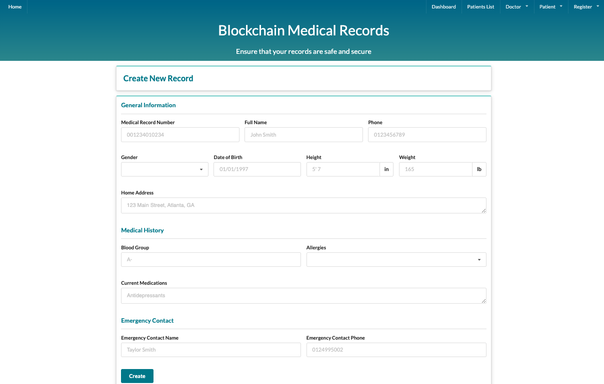
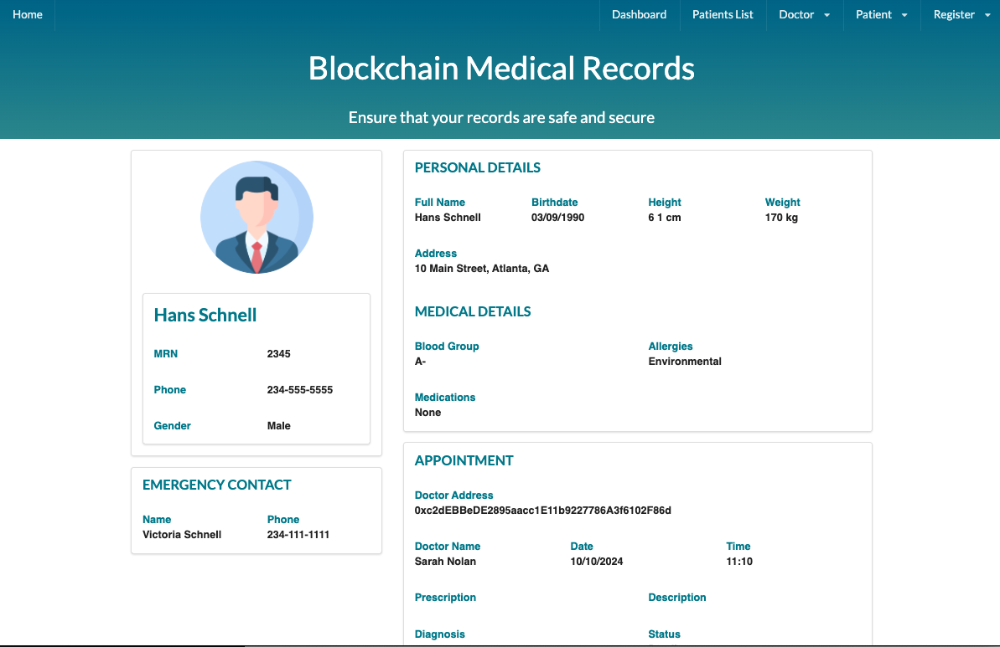
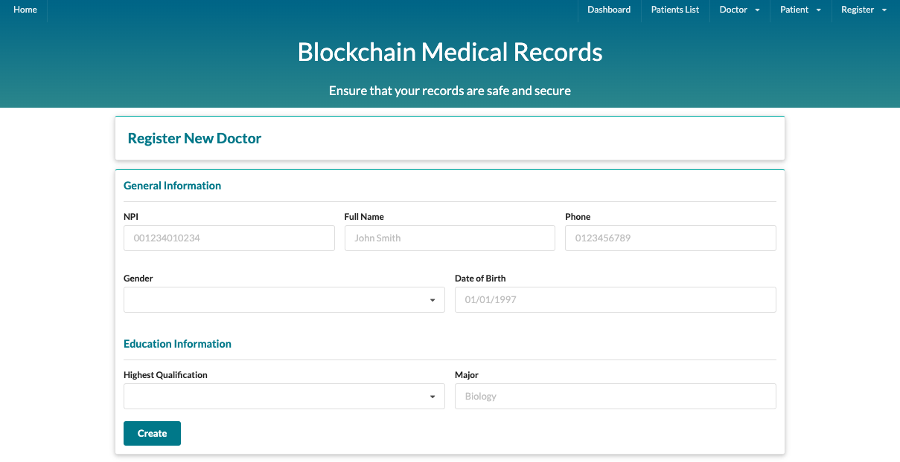
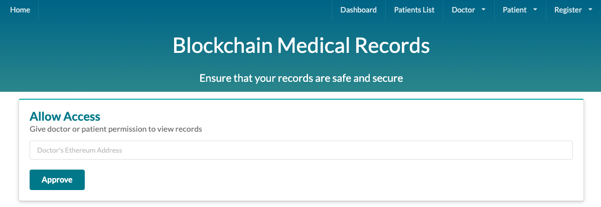
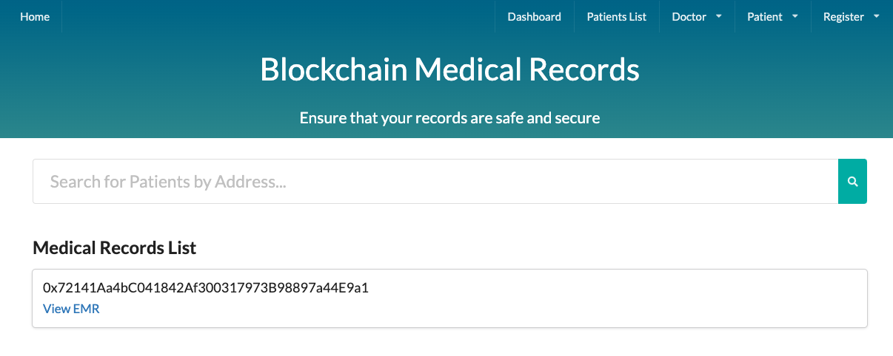
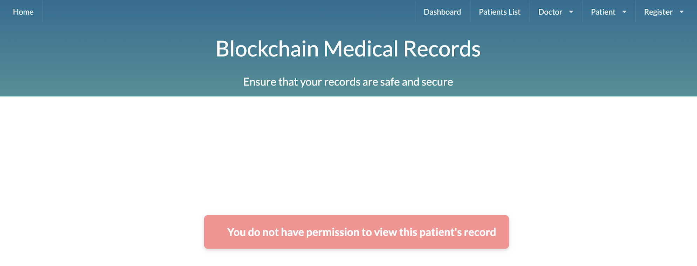

# A Blockchain Medical Records System

## Site URL

[coming soon]

<!-- [EHR DApp URL](https://ehr.inovantech.com) -->

## About

This Decentralized App implements an Electronic Health Records System on the Blockchain. A doctor or patient will be able to perform these tasks on the EHR system once they have connected their wallet:

1. Patients:

   - Register/view/edit account
   - Grant doctors (addresses) access to their account
   - Revoke doctors (addresses) access
   - View a metrics dashboard

2. Doctors
   - Register/view/edit account
   - Get a list of patients and access to their record if permission was granted
   - Make/update appointments
   - View a metrics dashboard

Features to be added:

- Ability to store more data types on IPFS such as images and PDFs
- Payment/billing feature
- Create this DApp on a private blockchain (this is just for demo purposes so this is on a public blockchain)

<div style="margin:0px;">
    
    <hr>
    
    <hr>
    
    <hr>
    
    <hr>
    
    <hr>
    
    <hr>
    
    <hr>
</div>

## Requirements and Setup

### Required Technologies and Libraries

```
Frontend:
    react 18.2.0
    semantic-ui-react 2.0.3
    web3 1.3.6
    next 8.1.0
    next-routes 1.4.2

Backend:
    ganache-cli 6.12.2
    solc 0.4.17
    truffle-hdwallet-provider 0.0.3
```

### Deployment Instructions

- Update the file below with your own Metamask Mnemonic and Infura link to a testnet:

```
/ethereum/deploy.js
```

- Under the `ethereum` directory, compile the Smart Contracts:

```
node compile.js
```

- Under the `ethereum` directory, deploy the Smart Contracts to the testnet (Sepolia for instance):

```
node deploy.js
```

- Update the file below with the Smart Contract Address:

```
/ethereum/record.js
```

- Install all requisite npm packages:

```
npm install
```

- Run the tests:

```
npm run test
```

- Update the file below with your own Infura link to a testnet:

```
/ethereum/web3.js
```

- Start the frontend web server:

```
npm run dev
```

- To test the app locally:

```
http://localhost:3000
```

- Configure and select the Sepolia Testnet

```
RPC URL: https://sepolia.infura.io/v3/
Chain ID: 11155111
```

- Connect your Metamask to the site manually
- Use different accounts to test patients and doctors tasks
